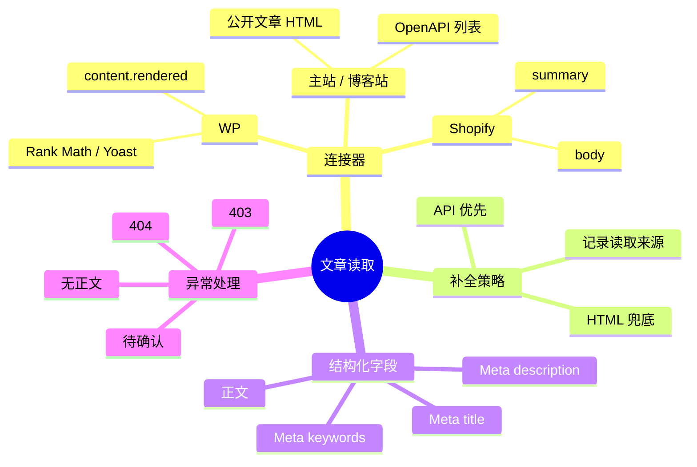
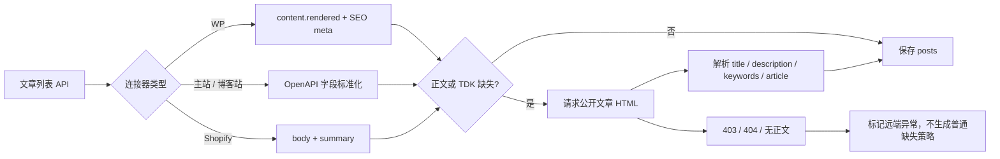
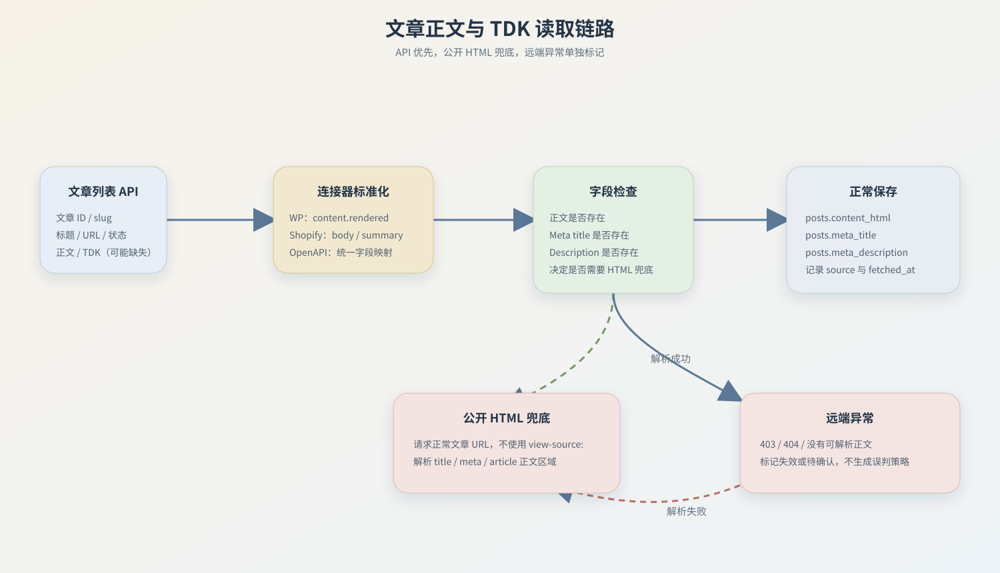

# 文章正文与 TDK 读取方案

> 记录时间：2026-07-17  
> 目录：`TXT/content-fetching-2026-07-17/`

## 1. 真实现状

本次从数据库统计了 8 个活跃站点，共 132 篇文章：

| 类型 | 站点 | 文章数 | 原先正文为空 | 根因 |
|---|---|---:|---:|---|
| 主站 | exdivo | 20 | 0 | OpenAPI 列表已返回正文 |
| Shopify | HealthyOxy Shopify | 4 | 4 | API 返回 `body`，旧标准化没有映射 |
| 博客站 | topvapes.de | 17 | 17 | 列表接口没有返回正文 |
| 博客站 | vape2026.de | 8 | 8 | 列表接口没有返回正文 |
| 博客站 | vapes1999 | 16 | 16 | 列表接口没有返回正文 |
| 博客站 | vapestest.de | 17 | 17 | 列表接口没有返回正文 |
| WP | vapes2000 | 22 | 0 | WP REST 已返回 `content.rendered` |
| WP | vapetopline | 28 | 0 | WP REST 已返回 `content.rendered` |

WP 的正文读取本身是正常的，主要问题是 Rank Math / Yoast 的 TDK 字段没有写入统一字段。主站和博客站使用自定义 OpenAPI；博客站的文章列表只返回文章元信息，正文需要从文章公开页面补齐。

## 2. `view-source:` 能不能直接使用

不能把 `view-source:https://example.com/article` 作为后端 HTTP 地址。

`view-source:` 是浏览器提供的查看源码界面，不是远端服务器的接口协议。后端正确做法是：

```text
请求 https://example.com/article
  → 获取响应 HTML
  → 解析 title / meta / article 正文区域
  → 写入 posts.content_html 和 TDK 字段
```

## 3. 本次采用的读取顺序

```text
站点文章列表 API
  → 连接器字段标准化
  → 已有正文优先保留
  → 正文或 TDK 缺失时读取公开文章 HTML
  → 解析正文、title、description、keywords
  → 写入 posts
```

连接器差异：

- **WP**：读取 `content.rendered`，同时读取 `meta`、`yoast_head_json` 中的 SEO 字段；缺失项再使用公开 HTML 兜底。
- **主站 / 博客站**：继续读取 OpenAPI 列表；正文或 TDK 缺失时请求 `articleUrlPath` 生成的公开文章 URL。
- **Shopify**：读取 GraphQL 返回的 `body` 和 `summary`；缺失 TDK 时读取 `/blogs/news/{handle}` 公开页面。

## 4. 当前同步结果

本次已使用新逻辑实际同步 132 篇文章：

- 主站：20 篇正文正常
- Shopify：4 篇正文正常
- 博客站：除 1 篇公开页面返回 404 外，其余正文和 TDK 均已读取
- WP：50 篇正文正常，TDK 已补齐

仍有 1 篇需要单独处理：

```text
vapestest.de / blog/gutscheincode-elfbar-germany-ratgeber
```

该 URL 当前返回 404，可能是远端文章已删除、改 slug，或列表数据已经过期。它不应该再被 AI 当作普通“正文缺失”，后续应标记为“远端页面失效 / 待确认”。

## 5. 代码变更

- `app/clients/http_client.py`
  - 增加统一的 HTML 文本请求能力。
- `app/services/post_sync_service.py`
  - 增加 Shopify `body` 标准化。
  - 增加 WP Rank Math / Yoast TDK 映射。
  - 增加公开 HTML 正文和 TDK 兜底解析。
  - 记录正文来源，后续可区分 API 与公开页面读取。
- `tests/test_post_sync_service.py`
  - 增加 Shopify 正文、HTML 正文和 TDK 解析测试。

## 6. 后续建议

当前最小方案已经能解决“正文为空”的主要问题。下一步不建议立刻把整篇竞争文章全文重复送入 AI，而是先在同步阶段保存文章结构化特征：

```text
正文长度 / H1-H6 / FAQ / 图片数 / 内链数 / TDK / 抓取来源 / 抓取时间
```

对于返回 403、404 或解析不到正文的页面，策略引擎应使用明确的异常状态，而不是继续生成“补正文”策略。

## 7. 读取链路图

### 思维导图



### 渲染链路




