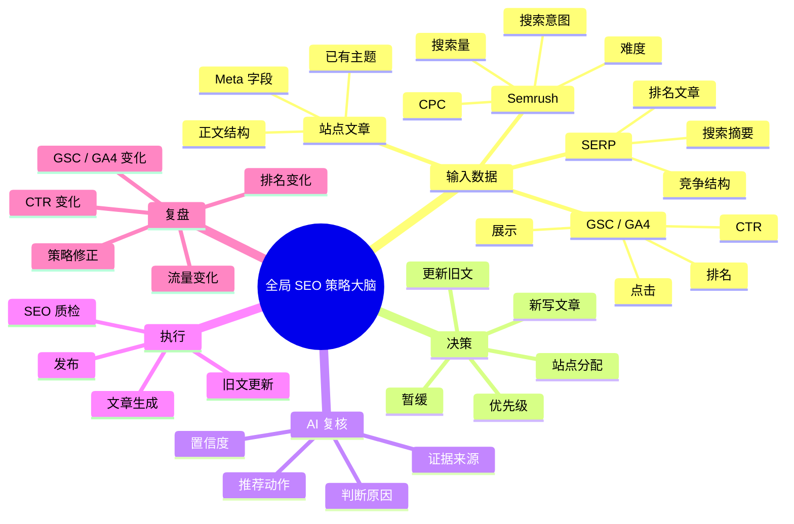
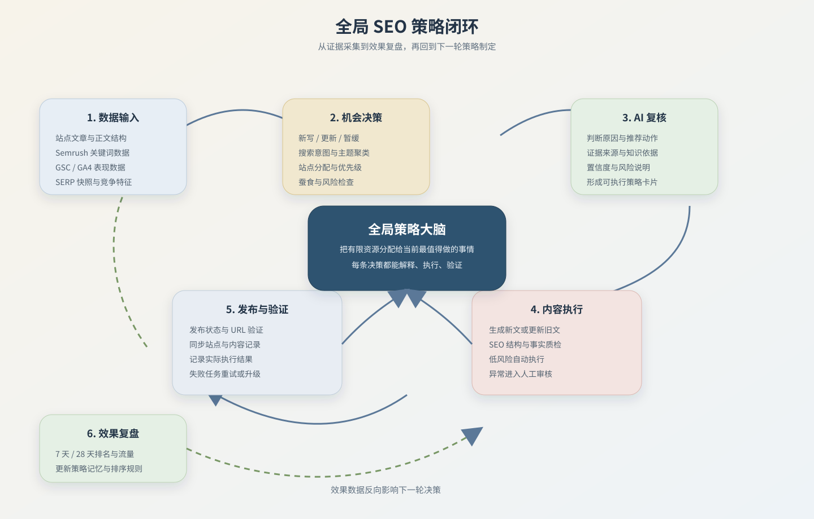

# 全局 SEO 策略：依据、不足与完整闭环

> 记录时间：2026-07-17  
> 阶段：全站内容扫描、AI 复核与全局策略大脑的方案讨论

## 一、当前结论

当前策略制定采用：

```text
本地规则初筛 + 真实业务数据 + SERP 数据 + AI 复核
```

它已经能够判断部分文章应该“新写、更新或暂缓”，但还不是完整的全局策略大脑。当前 AI 主要负责复核重点候选，还没有完全接管“今天所有站点应该做什么”的决策、执行、效果验证和下一轮调整。

## 二、当前策略依据

### 1. 站点文章数据

扫描各站点的文章记录，主要检查：

- 标题、描述、Meta title、Meta description
- 主关键词、Meta keywords
- 发布状态、发布时间和文章 URL
- 正文是否存在
- H2-H6、FAQ、Markdown 标题结构
- 是否已有相同或相近主题

这些数据用于发现旧文章的 SEO 基础缺陷，并判断是否值得更新。

### 2. Semrush 关键词数据

主要使用：

- 搜索量
- 关键词难度
- CPC
- 搜索意图
- 页面类型
- 关键词是否已有文章覆盖
- 关键词适合分配到哪个站点

这些数据主要用于寻找新文章机会和确定文章类型。

### 3. GSC / GA4 数据

如果当前站点已有数据，会参考：

- 展示次数
- 点击次数
- 平均排名
- CTR
- 页面访问量
- 用户参与度

当前 GSC / GA4 数据还不充分，因此只能作为辅助依据，不能单独决定策略。

### 4. SERP 数据

当前已经接入并持久化 SERP 快照，主要包含：

- 排名前列文章的标题
- URL
- 搜索摘要
- 查询词和抓取时间

当前还没有完整抓取和结构化分析竞争文章的全文、标题层级、FAQ、内链和内容覆盖范围。

### 5. 本地规则与 AI 复核

本地规则先对候选进行分类和排序：

- 新写文章
- 更新旧文
- 暂缓
- P0-P3 优先级

AI 再对重点候选进行复核，输出：

- 行动类型
- 优先级
- AI 置信度
- 判断原因
- 推荐动作
- 使用的数据来源

因此，当前页面上的结果已经不是纯规则结果，但 AI 仍处于“候选复核层”，还没有完全替代全局规划层。

## 三、当前链路

```text
站点与文章扫描
  → 本地规则筛选
  → 关键词、GSC、GA4、SERP 证据补充
  → AI 复核重点候选
  → 人工审核
  → 内容生成或更新
```

## 四、思维导图



## 五、当前不足

1. **文章正文不完整**：部分列表接口只返回文章摘要或 `content: null`，会导致文章被误判为“正文缺失”。
2. **竞争分析不够深**：SERP 目前以标题、链接、摘要为主，还没有形成竞争文章结构和内容差距分析。
3. **缺少关键词蚕食判断**：还没有系统判断多个站点或多篇文章是否争夺同一个主题。
4. **置信度没有校准**：目前置信度主要来自规则权重和 AI 返回值，还不是基于历史成功率的概率。
5. **缺少业务目标约束**：暂未充分纳入转化目标、站点产能、内容风险、商业价值和更新成本。
6. **发布后没有反馈回路**：策略执行后，GSC / GA4 结果还没有自动反向影响下一轮策略。
7. **自动化尚未闭合**：AI 复核、内容生成、质量检查、发布和异常升级之间仍有人工断点。

## 六、完整闭环应该是什么

```text
全站扫描
  → 文章结构化分析
  → 关键词与主题聚类
  → 搜索意图识别
  → SERP 竞争分析
  → 新写 / 更新机会识别
  → 全局资源排序
  → 生成带证据的策略
  → AI 复核
  → 生成或更新内容
  → 内容质量检查
  → 自动发布或异常审核
  → 验证发布结果
  → 7 天 / 28 天收集 GSC、GA4
  → 判断策略是否成功
  → 更新策略记忆与排序规则
  → 进入下一轮规划
```

一条完整策略至少要保存：

- 目标站点
- 新写、更新或暂缓
- 目标文章或新主题
- 主关键词和关键词集群
- 搜索意图
- 竞争差距
- 推荐标题、Meta、H2、FAQ 和文章结构
- 内链建议
- 优先级和执行时间
- 数据依据与知识依据
- 置信度
- 成功指标
- 失败后的下一步动作
- 实际执行结果
- 发布后的效果结果

## 七、最小落地顺序

### 第一步：补全文章分析

获取文章详情，提取并保存每篇文章的结构化分析：

```text
标题 / Meta / 关键词 / 字数 / H2-H6 / FAQ / 链接 / 图片 / 更新时间
```

### 第二步：补全 SERP 竞争分析

保存竞争文章的必要结构特征，而不是每次把全文重复塞给 AI：

```text
标题层级 / 文章长度 / FAQ / 主题覆盖 / 内链特征 / 抓取时间
```

### 第三步：保存策略全过程

每条策略都记录：

```text
输入证据 → AI 判断 → 执行动作 → 执行结果 → 发布效果
```

### 第四步：增加发布后复盘

至少在发布后第 7 天和第 28 天检查：

- 展示是否增加
- 点击是否增加
- 平均排名是否改善
- CTR 是否改善
- 是否出现新的关键词覆盖

### 第五步：再开放自动发布

建议先采用分级策略：

- 低风险 Meta、结构和 FAQ 更新：可自动执行
- 新文章生成：先自动生成，保留审核
- 高风险内容、主题冲突和数据不足：必须人工介入

## 八、阶段性判断

当前最重要的不是立即让 AI 自动发布，而是让它能够明确回答：

> 为什么选择这篇文章？依据是什么？执行后是否成功？

当这三个问题都可以被系统记录和验证时，策略大脑才真正具备闭环能力。



