# 策略执行与效果闭环 V1

日期：2026-07-19

状态：代码已实现并完成本地自动化验证；当前运行中的后端仍需用户通过根目录 `start-backend.bat` 手动重启。尚未执行第一条真实新策略，也没有跨 7 至 90 天的真实效果样本。

## 业务链路

```mermaid
flowchart LR
  A["Semrush 页面簇导入"] --> B["本地边界校验"]
  B --> C["页面簇 AI 分站"]
  C --> D["关联同站文章库存"]
  D --> E["新写 / 更新 / 蚕食 Hold 候选"]
  E --> F["人工保存今日计划"]
  F --> G["人工审核执行"]
  G --> H["执行前重新验证"]
  H --> I["保存 T+0 基线"]
  I --> J["生成并通过 QA"]
  J --> K["幂等发布或更新"]
  K --> L["远端回读验证"]
  L --> M["T+7 / 14 / 28 / 56 / 90 观察"]
  M --> N["winner / neutral / loser / inconclusive / contaminated"]
  N --> D
```

## 关键约束

- Semrush 源字段 `Topic / Page / Page type` 保持不变；本地规则只做可解释的第一层校验。
- AI 按页面簇分析，不逐关键词分站；边界不可靠的簇保持 Hold。
- 策略在审核时和实际执行前各验证一次：业务、站点、今日计划、最新扫描、候选指纹、关键词/文章目标、冲突任务和冷却锁任一变化都会阻塞旧策略。
- 更新策略的稳定范围优先锁定 `post_id/article_id`；新文策略锁定页面簇或查询意图。
- 同一页面更新发布后进入 28 天冷却；同一意图的新页面一旦发布，禁止再次创建重复新文。
- 执行前必须保存最近 28 天 GSC/GA4 基线；基线失败则策略失败，不继续生成或发布。
- 正式发布只接受人工批准的策略执行链。文章管理页只做只读预检。
- 发布前先检查本地远端 ID 和 slug，发布后回读核对远端 ID、标题、URL/slug、公开状态；核对失败不把本地文章标为已发布。
- 效果观察复用 `seo_agent.tasks` 的 `payload.kind=strategy_effect`，不新增数据库表。每小时检查到期记录，只读取指标并写本地观察数据，不触发文章策略或外站写入。
- 第 7、14 天只给出证据不足/受干扰等观察性结论；第 28 天后且展示量达到门槛，才允许判断 winner、neutral 或 loser。

## 页面呈现

“今日策略”固定展示五步：扫描站点、生成候选、保存计划、审核执行、效果观察。效果观察按业务显示基线、最新检查点、当前结论、下一检查时间和冷却截止时间。关键词页刷新后可恢复仍在运行的页面簇 AI 任务；文章页不再提供正式发布旁路。

## 验证边界

已验证：当前项目根目录 `tests/` 全量回归 215 项、Python 编译、前端 TypeScript/Vite 构建、差异格式检查。

未验证：真实 WP/自定义博客本轮发布回读、真实旧文更新、第一条 `strategy_effect` 数据以及真实 T+7 至 T+90 指标结果。上述验证必须由用户手动重启后，从页面批准一条策略开始，不能用测试通过替代真实上线结论。
