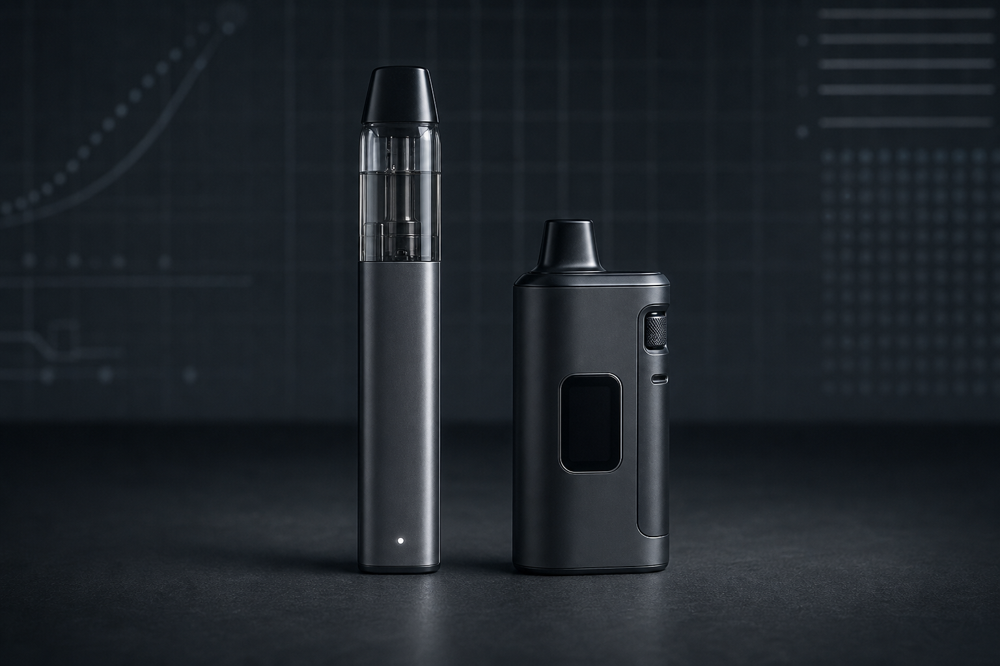

# Beyond Puff Count: How Adult Users Can Compare High-Capacity Vapes

*Two high-capacity vape formats shown for editorial comparison. Original image created for this article by the ExDivo Editorial Team.*

Walk through almost any current vape catalog and the largest number on the page will usually be the estimated puff count. It is easy to understand why. A figure such as 25,000 or 35,000 gives shoppers a quick way to separate one device from another.

It is also an incomplete way to choose.

A puff estimate is not a promise of how many draws every user will receive. Draw length, airflow, power delivery, usage frequency, storage conditions, and the way the manufacturer performs its estimate can all affect the result. Two devices with similar puff labels may also differ significantly in their e-liquid capacity, coil, battery, charging system, display, and replaceable components.

For adult users comparing high-capacity devices, the better question is not simply, “Which number is bigger?” It is, “How does the whole device fit the way I intend to use and maintain it?”

## 1. Start with the device architecture

The first distinction to make is between a conventional disposable device and a system with a replaceable component.

A disposable vape is sold as an integrated unit. Its appeal is simplicity: there are fewer separate parts to select and manage. A replaceable-pod or replaceable-mouthpiece design introduces another step, but it may allow part of the system to be changed instead of treating every component as one sealed unit.

The product name alone does not always explain which component is replaceable. Read the specification sheet and package instructions carefully. “Replaceable pod,” “replaceable mouthpiece,” and “refillable” do not automatically mean the same thing.

This distinction matters more than a puff estimate because it changes the daily routine. Before purchasing, an adult user should know which components are replaceable, whether replacements are included, how they are installed, and what must be discarded when the product reaches the end of its usable life.

## 2. Treat puff count as an estimate, then check e-liquid capacity

Manufacturers usually present puff count as an estimated maximum. It should be read alongside the listed e-liquid capacity rather than as a standalone measurement.

For example, ExDivo lists its [KUZ 25K Replaceable Pod Vape](https://exdivo.com/products/exdivo-kuz-25k-replaceable-pod-vape) with a 10 ml + 10 ml configuration and an estimated maximum of 25,000 puffs. Its INTERSTELLAR 35K Disposable Vape is listed with 15 ml of e-liquid and an estimated maximum of 35,000 puffs.

Those figures describe different device designs. They should not be used to calculate an exact number of puffs per milliliter or an exact number of days of use. There is no universal puff across all users or devices. A short draw and a long draw do not consume liquid or battery power in precisely the same way.

The practical lesson is simple: use puff count to understand the manufacturer’s intended capacity class, then use the remaining specifications to decide whether the device makes sense.

## 3. Look for information you can actually monitor

High-capacity devices can be difficult to judge when the user cannot see the liquid level or obtain useful device information.

The KUZ 25K specification includes a visible transparent oil tank and a bottom LED indicator. The visible section can help an adult user check the remaining liquid directly instead of relying only on taste changes or guesswork.

The INTERSTELLAR 35K Disposable Vape takes a different approach. Its listed features include a side display screen. A screen can be useful, but only when the manufacturer clearly explains what it displays. Battery status, liquid status, and operating mode are different data points. Do not assume that every screen measures all three.

In other words, the presence of a display is less important than the clarity and usefulness of the information it provides.

## 4. Understand what the coil specification does—and does not—tell you

Coil descriptions are another common comparison point. The KUZ 25K and INTERSTELLAR 35K are both listed with mesh coils. The public specifications list a resistance of 0.8 ohm for the KUZ and 1.0 ohm for the INTERSTELLAR.

Mesh refers to the structure of the heating element. Resistance is one part of the electrical design. Neither specification, by itself, guarantees better flavor, larger vapor production, longer life, or a particular sensation. Those outcomes also depend on power management, airflow, liquid formulation, and individual draw style.

Be cautious with product descriptions that turn one coil term into a sweeping performance claim. A useful specification tells you how a device is built; it does not replace independent testing or personal compatibility.

## 5. Compare airflow and draw control

Airflow can materially change how a device feels in use. A tighter setting and a more open setting can produce different draw resistance and may affect consumption.

The INTERSTELLAR 35K product specification lists bottom two-level adjustable airflow. That gives the user a limited choice between settings rather than a single fixed configuration. Someone considering the device should still check the user guide to understand the control and avoid blocking the air inlet during use.

If a product page does not mention airflow, do not assume it is adjustable. This is one area where a modest but clearly documented control may be more valuable than a decorative feature.

## 6. Read the charging specification carefully

Both ExDivo examples list Type-C charging. That describes the connector format. It does not, on its own, establish charging speed, battery quality, or compatibility with every power source.

The KUZ 25K public specification lists an 1100 mAh rechargeable battery, while the INTERSTELLAR 35K lists a 650 mAh rechargeable battery. A larger capacity figure does not automatically make one complete device “better.” The devices have different architectures and power demands.

Use the supplied instructions and the charging equipment recommended by the manufacturer. Charge on a clean, flat surface away from heat and combustible materials. Do not use a damaged cable, damaged charging port, swollen device, or device that becomes unusually hot. A rechargeable disposable should never be opened or modified in an attempt to repair or refill it.

## A practical comparison of two ExDivo formats

| Specification | ExDivo KUZ 25K | ExDivo INTERSTELLAR 35K |
|---|---|---|
| Listed format | Replaceable pod/mouthpiece design | Disposable vape |
| Manufacturer-stated puff estimate | Up to 25,000 | Up to 35,000 |
| Listed e-liquid configuration | 10 ml + 10 ml | 15 ml |
| Coil | Mesh, 0.8 ohm | Mesh, 1.0 ohm |
| Battery | 1100 mAh rechargeable | 650 mAh rechargeable |
| Charging connector | Type-C | Type-C |
| Monitoring feature | Visible oil tank and bottom LED | Side display screen |
| Airflow | Not specified as adjustable on the general product page | Bottom two-level adjustable airflow |

This table is useful precisely because it does not declare a universal winner. The KUZ emphasizes a visible reservoir and a replaceable structure. The INTERSTELLAR emphasizes a compact disposable format, side display, and two-level airflow adjustment. The right comparison depends on which of those features an adult user will actually use.

## A six-question checklist before buying

Before choosing any high-capacity vape, ask:

1. Is the puff count clearly described as an estimate rather than a guaranteed result?
2. What is the listed e-liquid capacity, and can the remaining liquid be monitored?
3. Which part, if any, is replaceable, and is that explained in the instructions?
4. What does the display or indicator actually show?
5. Is airflow fixed or adjustable?
6. What battery, connector, and charging precautions does the manufacturer specify?

Price and flavor may influence the final decision, but they should not replace this basic specification check. Adults who do not currently use tobacco or nicotine products should not start. Products containing nicotine are addictive, must be kept away from children and pets, and should only be considered by adults of legal age where their sale and possession are permitted.

## The bottom line

The biggest number on a vape package is often the easiest feature to market. It is rarely the most complete way to compare devices.

A more responsible evaluation starts with architecture, liquid capacity, replaceable parts, coil specifications, monitoring features, airflow, and charging instructions. Puff count can remain part of the comparison, but it belongs in context.

That approach will not produce one answer for every adult user. It will produce something more useful: a decision based on documented specifications instead of a single headline number.

---

**About the author:** The ExDivo Editorial Team covers device specifications, product design, and practical comparison frameworks for adult vape users. Product information in this article was checked against ExDivo’s catalog and public product pages before submission.

**Disclosure:** This article was contributed by the ExDivo Editorial Team. ExDivo manufactures and sells the products mentioned as examples.
