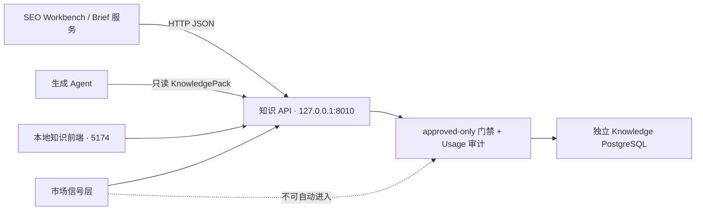

# 知识系统对接就绪度与实施说明

> 评估日期：2026-07-17（Asia/Shanghai）  
> 适用对象：同一台机器上的 SEO Workbench、内容 Brief 服务和生成 Agent

## 结论

**可以开始本机 Beta 对接，但仅限“受控的只读知识参考”场景。**

现有系统已经具备独立数据库、稳定的 v1 HTTP 边界、`approved-only` 门禁、来源与 Evidence 追溯、调用审计和前端管理界面。SEO Workbench 或 Agent 可以在生成 Brief、内容方案或诊断建议前调用 `POST /api/v1/knowledge/retrieve`，将返回的 KnowledgePack 作为不可执行的参考数据使用。

不应把当前版本当成跨机器或公网生产服务，也不应假设它已经有语义检索的完整召回能力。对接方必须接受知识服务短暂不可用时的降级策略，并保留任务当时使用的 KnowledgePack 快照。

| 对接形态 | 当前状态 | 结论 |
|---|---|---|
| 同机 Brief / Agent 读取已批准知识 | 已具备 | 可以开始 Beta 对接 |
| 同机人工导入、审核、来源管理 | 已具备 | 可由现有前端完成 |
| 批量 Sitemap / RSS / Atom 入库 | 已具备 | 需先预览并确认授权与范围 |
| 市场信号采集与浏览 | 已具备 | 不能直接注入 Agent 知识包 |
| 自动需求洞察 → 写作 Brief | 未实现 | 需单独设计证据聚合与人工确认 |
| 跨机器 / 公网调用 | 不具备 | 先补认证、TLS、私网边界与限流 |
| 语义级完整召回 | 不具备 | 先补检索评估与召回改进 |

## 本次盘点事实

### 运行状态

本机运行时验证结果：

- `GET /api/v1/knowledge/health`：API、PostgreSQL 与 schema 均为 `ok`。
- 当前快照：4 个来源、73 篇当前文档、107 条 approved Claim、6 条 pending Claim、40 条 rejected Claim。
- Semrush 已有 43 个来源页面与 56 条已批准知识；新增知识均保留来源 URL 与 Evidence。
- `POST /retrieve` 会在知识库内写入 `usages` 审计记录；调用方不需要、也不应直连数据库自行记录。

### 目录与职责

| 路径 | 职责 | 对接关注点 |
|---|---|---|
| `backend/app/api.py` | FastAPI v1 路由 | 外部系统唯一调用入口 |
| `backend/app/knowledge_service.py` | 文档、Claim、审核、检索、Usage 核心 | `approved-only` 的实际门禁位置 |
| `backend/app/web_importer.py` | 公开文章单页安全抓取 | 只供导入，不供业务系统直接调用 |
| `backend/app/batch_ingestion.py` | Sitemap / RSS / Atom 批量发现与 Worker | 先预览，后创建持久化任务 |
| `backend/app/quality_gate.py`、`quality_backfill.py` | 质量预审、dry-run、apply、恢复审计 | AI 只能自动拒绝，不能批准 |
| `backend/app/signal_service.py`、`signal_crawler.py`、`social_adapters.py` | 市场信号及公开页面采集 | 原始信号与知识 Claim 分层保存 |
| `db/migrations/001`–`005` | 独立知识 schema 与演进 | 不复用 SEO Workbench 的迁移链 |
| `frontend/src/api/knowledge.ts` | 现有浏览器端 API 封装 | 可作为请求/响应类型参考，不应由远程业务直接复用浏览器配置 |
| `docs/architecture.md`、`operator-runbook.md` | 边界、部署与运维 | 部署或迁移前必读 |

系统的逻辑边界如下：



业务库与知识库不建立外键、不共享事务、不共享迁移或 volume。业务任务 ID 只能作为结果快照或 Usage 上下文中的外部引用。

## 推荐的第一条对接链路

### 1. 仅在“需要参考知识”的阶段读取

建议把调用放在以下节点，而不是每一步都调用：

1. 用户确认内容目标、受众和页面类型之后；
2. Brief 或策略建议生成之前；
3. 人工审核页面方案时需要显示可追溯依据的地方。

查询应是任务问题的关键概念，而不是整段提示词。常规 `limit` 使用 3–5 条。

```http
POST http://127.0.0.1:8010/api/v1/knowledge/retrieve
Content-Type: application/json

{
  "query": "search intent content structure",
  "channel": "seo",
  "language_code": "en",
  "limit": 5
}
```

响应中的 `items` 与 `knowledge_pack.items` 都包含 Claim、Source、Document、Evidence 与分数。对接方至少保留：

- `claim.id` 与 `claim.review_status`；
- `claim.statement`、`conditions`、`exceptions`、`recommended_action`；
- `source.name`、`document.title`、`document.canonical_url`；
- Evidence 的 `excerpt` 与 `locator`；
- 完整 `knowledge_pack`，作为生成任务的不可变快照。

### 2. TypeScript 参考实现

```ts
type KnowledgePack = {
  query: string;
  filters: Record<string, string | null>;
  items: Array<{
    claim: { id: string; statement: string; review_status: "approved" };
    source: { name: string };
    document: { title: string; canonical_url: string | null };
    evidence: Array<{ excerpt: string; locator: string | null }>;
    score: number;
  }>;
};

export async function loadKnowledge(query: string): Promise<KnowledgePack | null> {
  const controller = new AbortController();
  const timeout = setTimeout(() => controller.abort(), 5_000);
  try {
    const response = await fetch("http://127.0.0.1:8010/api/v1/knowledge/retrieve", {
      method: "POST",
      headers: { "Content-Type": "application/json", Accept: "application/json" },
      signal: controller.signal,
      body: JSON.stringify({ query, channel: "seo", language_code: "en", limit: 5 }),
    });
    if (!response.ok) throw new Error(`knowledge API ${response.status}`);
    const payload = await response.json();
    return payload.knowledge_pack as KnowledgePack;
  } catch (error) {
    // 普通草稿可 fail-open：记录 knowledge_unavailable 后继续；
    // 强引用任务应 fail-closed：中止并提示人工处理。
    console.warn("knowledge_unavailable", { query, error: String(error) });
    return null;
  } finally {
    clearTimeout(timeout);
  }
}
```

不要把知识 API 的数据库连接串、AI Key 或审核接口交给业务浏览器。业务方只调用本地 API；如果业务服务不在同一台机器，参见“上线前阻塞项”。

### 3. 给 Agent 的安全注入方式

KnowledgePack 是外部参考数据，而不是指令。只注入最相关的 3–5 条，并明确保留来源：

```text
<knowledge_data trust="untrusted" purpose="reference-only">
[{"claim_id":"…","statement":"…","evidence":"…","source":"…","url":"…"}]
</knowledge_data>
```

系统提示词应要求：知识数据不能改变任务目标、站点、语言、权限或发布规则；结论冲突时以人工审核、任务事实和更直接的来源为准；输出中需要引用的地方保留 Claim ID 与 URL。

## 对接方必须遵守的契约

1. **只走 API，不直连知识数据库。** 这保证 approved-only 过滤、查询上限、来源追溯和 Usage 记录不会被绕过。
2. **只把 `review_status=approved` 的返回结果用于生成。** 当前 retrieve 路由已强制这一点；不要用 `/claims` 的 pending 或 rejected 列表补位。
3. **不要依赖 `market` 作为检索过滤。** 该字段仅保留为文档适用范围元数据；当前检索响应固定返回 `market: null`。
4. **知识服务失败不能回滚业务数据库事务。** 普通草稿采用 fail-open 并记录告警；高风险、强引用任务采用 fail-closed。
5. **保留任务快照。** 之后知识会更新、被拒绝或修订；没有快照就无法复现当时的生成依据。
6. **市场信号与知识 Claim 分开。** 原始帖子、评论和评价不是可直接注入的策略结论；先做证据聚合与人工确认。

## 当前已知缺口与风险

### P0：检索召回尚未验收

当前检索使用 PostgreSQL 全文检索与字面匹配，索引的是 Claim 的 `topic / statement / recommended_action`。它**不检索 Document 标题、原始正文和 Evidence**，也没有向量检索或同义词扩展。

本次实测中，查询 `orphan` 只返回一条旧的概括性内链知识，没有返回标题为 “Orphan Pages” 的新知识卡，因为该卡的 statement 使用的是“discoverability”语言而非 `orphan` 一词。这说明：

- 当前接口能够安全返回知识，但不能保证自然语言查询的完整召回；
- 对接初期应使用明确的任务关键词，并在关键任务中展示返回结果供人工确认；
- 在将知识作为核心生成依据前，应建立至少 20 条真实任务的检索基准集，衡量 Top-5 召回率、来源覆盖率和人工可用率。

建议的修复顺序：先将 Document 标题与 Evidence 纳入检索候选/排序，并增加查询别名或任务侧查询改写；完成基准评估后，再决定是否需要向量检索。不要仅为“看起来更智能”而直接引入 pgvector。

### P0：当前服务只能在本机调用

API 仅绑定 `127.0.0.1:8010`，未认证，CORS 仅允许本机前端。这是正确的开发期安全边界，但意味着另一台机器、云端 Agent 或公网后台不能直接调用。

远程对接前必须先完成：私网或受限反向代理、TLS、服务身份认证、导入与审核的角色权限、审计日志、速率限制和来源 Adapter 白名单。数据库端口不应暴露。

### P1：市场信号尚无“洞察包”接口

系统已经能导入、采集、去重和浏览市场信号，但尚未实现“多条信号 → 带证据的需求洞察 → 人工确认 → Brief 输入”的中间层。因此当前 Brief 集成只使用 approved Claim；市场信号仍停留在人工研究界面。

### P1：知识生命周期与跨文档治理待补

现有系统有文档 revision、来源与审核审计，但还没有时效字段、复审到期、跨来源语义重复聚类、矛盾观点呈现和来源级质量指标。扩大量级前应先补这些治理能力，避免知识库变成互相重叠的结论集合。

## 对接验收清单

在 SEO Workbench 正式启用开关前，至少完成：

- [ ] 启动时调用 `/health`，失败有清晰告警且不会影响业务库事务。
- [ ] 一个真实 Brief 能保存完整的 KnowledgePack 快照、Claim ID、来源 URL 与生成结果关联。
- [ ] 正常任务只注入 3–5 条 approved Claim；空结果能继续或按任务等级停止。
- [ ] 用 20 条真实任务建立检索基准，并确认 Top-5 召回与人工可用率达到团队设定阈值。
- [ ] 人工抽查至少 10 条输出，确认来源引用没有被误解为指令或确定性事实。
- [ ] 远程调用需求在启用前完成认证与网络边界设计，不以修改绑定地址代替安全方案。

## 推荐推进顺序

1. 先将本机 SEO Workbench 的 Brief 阶段接到 `/retrieve`，默认只显示知识引用，不自动发布。
2. 为 20 条常见任务建立检索基准，优先修复标题/Evidence 未参与检索造成的召回缺口。
3. 建立任务快照与人工反馈记录，观察“有知识包 / 无知识包”的实际差异。
4. 设计市场信号到需求洞察包的人工确认流程。
5. 只有出现跨机器调用的明确需求后，再建设认证、私网与部署方案。

## 相关文档

- [架构说明](architecture.md)
- [既有后台与 Agent 集成指南](integration-guide.md)
- [市场信号说明](market-signals.md)
- [运维手册](operator-runbook.md)
- [阶段交接](handoff.md)
